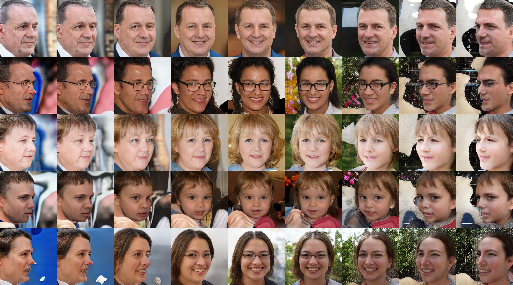

# PyTorch Implementation of [EigenGAN](https://arxiv.org/pdf/2104.12476.pdf) 


**Train**
```
python train.py [image_folder_path] --name [experiment name]
```

**Test**
```
python test.py [ckpt path] --traverse
```


**FFHQ** 

[[ckpt]]()

samples (no truncation)


Learned subspace: L0 D1


Learned subspace: L1 D2


**Note** 

Training configurations are different from the original implementation 

Tested on python 3.8 + torch 1.8.1
