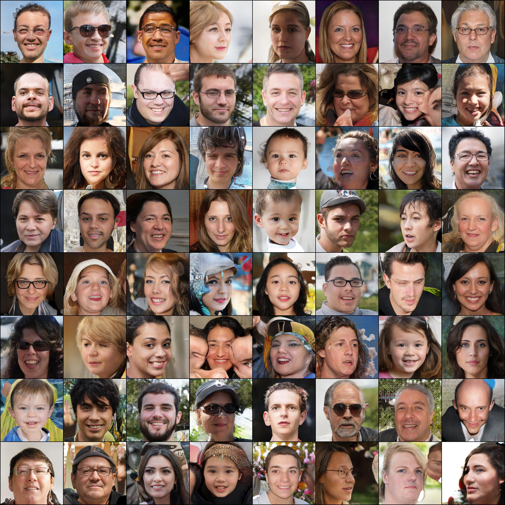
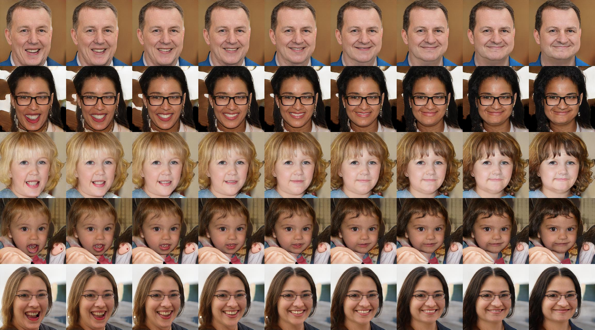
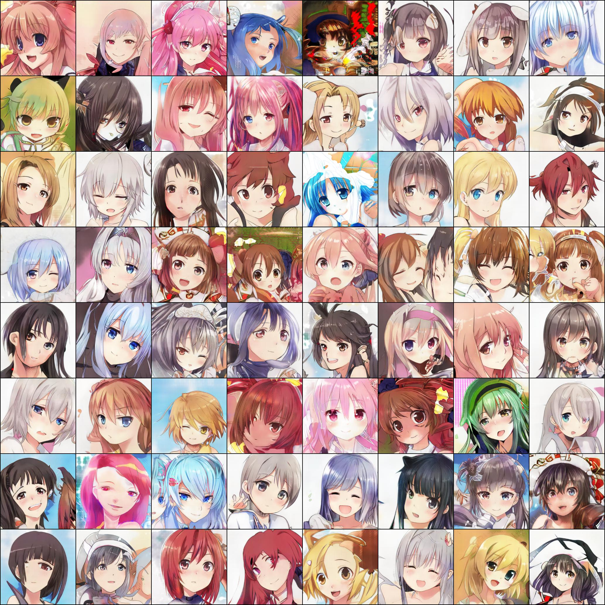
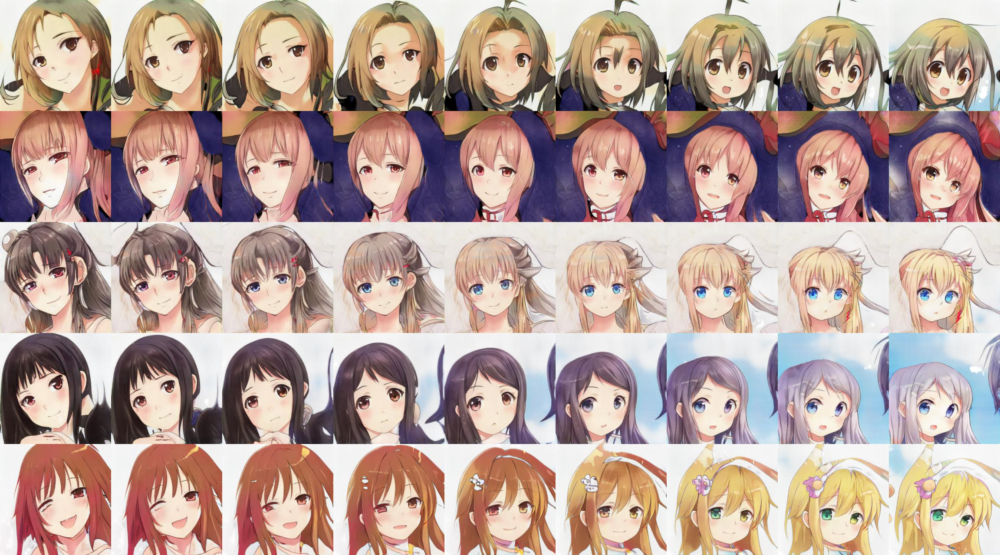
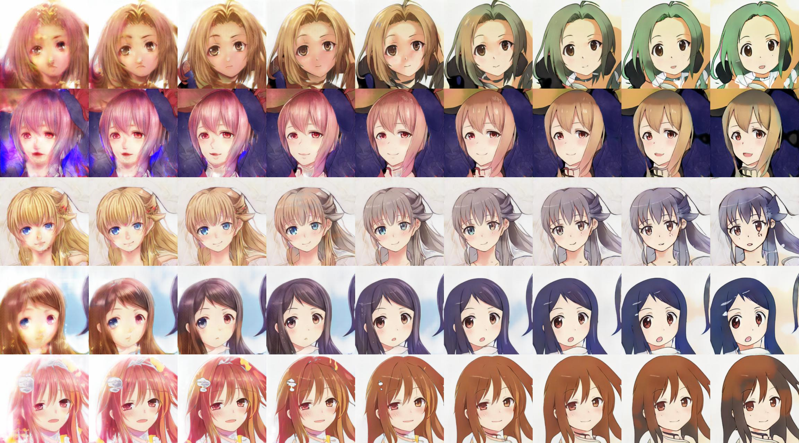

# PyTorch Implementation of [EigenGAN](https://arxiv.org/pdf/2104.12476.pdf) 


**Train**
```
python train.py [image_folder_path] --name [experiment name]
```


**Test**
```
python test.py [ckpt path] --traverse
```


**FFHQ** 

[[ckpt]](https://drive.google.com/file/d/1WNHlNibrgEo0elVB-epS5GO2J0YzkvNC/view?usp=sharing)

samples (no truncation)



Learned subspace: L0 D1


Learned subspace: L1 D2



**Anime**

[[ckpt]](https://drive.google.com/file/d/1NO6oXs4yvtIidirXqG9HxbEyHS9l8jdR/view?usp=sharing)

samples (no truncation)



Learned subspace: L0 D5


Learned subspace: L1 D2



**Note** 

Default training configurations are different from the original implementation 

Tested on python 3.8 + torch 1.8.1


**Issue**

Some of the subspace layers seem to collapse and have no effect on the resulting images as the training proceeds and FID get betters.
